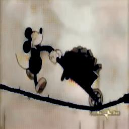

# Colorization by Improved-CycleGAN

## Overview
Image-to-image translation aims at learning a mapping of images between different domains, and many successful tasks relied on aligned image pairs. However, it’s not easy to generate paired data for general tasks. Besides, it’s known that generative adversarial networks (GANs) has excellent performance in image generation and image editing. Therefore, **we design a system, built on existed Cycle-GAN model, to translate black-and-white film into colorized one automatically.**

## Demo
### Dataset
1. Create a dataset folder in "datasets", ex: micky
2. Put some training data in "trainA" and "trainB", ex: Gray scale in A and RGB in B
3. Put some testing data in "testA" and "testB", ex: Gray scale in A and RGB in B

&emsp;**[Note]**  
&emsp;&emsp;(1). CycleGAN can transfer something from domain A to domain B and from domain B to domain A  
&emsp;&emsp;(2). In "trainA" and "trainB", I only put some image as example. 

### Training
1. Run *main.py* to training our Improved-CycleGAN
2. Command line:  
```
CUDA_VISIBLE_DEVICES=0 python main.py --dataset_dir=micky --phase=train
```

### Testing
1. Run *main.py* to testing our Improved-CycleGAN
2. Command line:  
```
CUDA_VISIBLE_DEVICES=0 python main.py --dataset_dir=micky --phase=test --which_direction=AtoB
```
3. AtoB means transfer image from A to B, ex: from Gray scale to RGB

## Result
**1. Flow Chart**
* We improved cycleGAN model with "Improved-WGAN", which is based on "WGAN".
<center>

<br>
</center>

**2. Some Results**
* Training Set
<table border=1>
<tr>
<td>


</td>
</tr>

</table>

* Testing Set
<table border=1>
<tr>
<td>





</td>
</tr>

</table>

**3. Training Visualization**
* Discriminator
da_loss means the loss of discriminator on domain A and db_loss means the loss of discriminator on domain B. d_loss is equal to (da_loss + db_loss) meaning discriminator loss.
<center>

<br>
</center>

* Generator
g_loss_a2b means the loss of generator for changing domain A to domain B and g_loss_b2a means the loss of generator for changing domain B to domain A. g_loss is equal to (g_loss_a2b + g_loss_b2a) meant generator loss.
<center>

<br>
</center>

## Requirements
* TensorFlow
* numpy, scipy, pillow

## Reference
* I reference a lot from [CycleGAN](https://arxiv.org/abs/1703.10593), [WGAN](https://arxiv.org/abs/1701.07875) and [Improved-WGAN](https://arxiv.org/abs/1704.00028)
* I also reference a lot code from [CycleGAN](https://github.com/xhujoy/CycleGAN-tensorflow)
